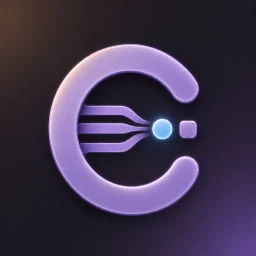
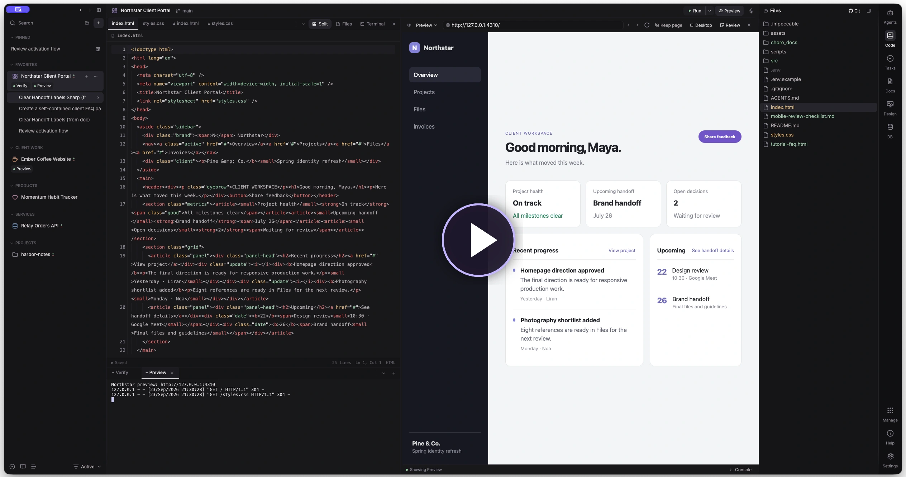
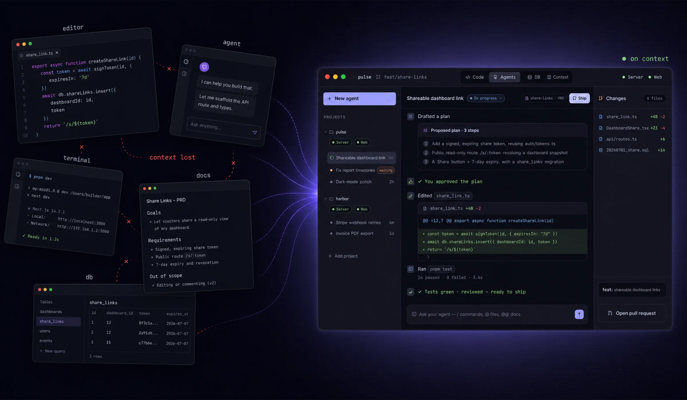

<p align="center">
  
</p>

<h1 align="center">Choro</h1>

<p align="center">
  One place to build your products
</p>

<p align="center">
  Everything you need to build and maintain your products, <strong>connected</strong> — so you never lose the thread between tools.<br>
  A local-first, open-source workspace <strong>on your Mac</strong> that keeps you <strong>calm and in flow</strong>. <strong>100% free.</strong>
</p>

<p align="center">
  Your projects, designs, and agent history stay on your Mac by default.<br>
  We don't host your workspace or have access to your local work.
</p>

<p align="center">
  <a href="https://github.com/Future-Picnic/choro/releases/latest">Download for macOS</a>
  · <a href="#build-from-source">Build from source</a>
</p>

[](https://youtu.be/VNggmqh5CjQ)

<sub>Captured from the real Choro Demo app with the fictional Northstar sample project. Select the image to watch the tour on YouTube.</sub>

## The hard part isn't code. It's context.

Agents can write the code. The hard part is keeping each run connected to the
spec, the project, the running app, and the other work already in motion. Choro
brings those pieces into one workspace on your Mac, with you deciding what
ships.



<sub>Illustrative example: the pieces of a fictional project, together in Choro.</sub>

## Agents that work like teammates

Bring your existing **Codex, Claude Code, or OpenCode** installation and sign
in through the provider's own flow. Choro gives you more than a chat box:

- **Chat or real CLI.** Work through a guided conversation with plans,
  questions, changes, and reviews—or use the agent's own terminal interface.
- **Parallel lanes.** Give solo agents separate Git worktrees so they can work
  without stepping on the main checkout. Rejoin a lane or ship its own PR.
- **Delegation when you need it.** Experimental agent bands let a lead split
  work between specialists and bring their contributions back together.

Every conversation keeps its own history and status, so you can move between
projects and pick up where you left off.

## Keep the intent attached to the work

Write specs and project notes in Choro, attach files, images, links, and designs,
or start from a task. An agent can take that context into implementation, while
the result links back to the work that started it. Project memory helps carry
useful decisions into later runs.

Choro also keeps personal tasks beside connected trackers such as Jira, Linear,
Asana, and ClickUp. A task is a starting point for work, not another tab to
keep open.

## A product workspace, not a chat wrapper

| In your project | What you can do |
| --- | --- |
| **Code & terminals** | Inspect and edit files yourself, run commands, or let an agent work. |
| **Design Studio** | Work on screens, components, and tokens in the project, then hand the design to an agent to implement. |
| **Live previews** | Run web apps, scripts, and an iPhone simulator beside the work; point out what needs changing. |
| **Data & services** | Explore connected databases and keep the services your app depends on within reach. |
| **Git & pull requests** | Follow branches, worktrees, diffs, commits, and PRs without losing project context. |

## Review, verify, then ship

When an agent finishes, Choro can compare the result with its starting spec,
plan, or task. Review findings appear beside the conversation; changed files
and diffs stay inspectable. Choose what to fix, what to commit, and whether to
push or open a pull request. The final decision stays with you.

## Local-first, even when you're away

The coding workspace and agents run on your Mac, using your own installed CLI
tools and provider plans. Choro does not give you a hosted coding machine or
resell model access. The optional Choro Remote lets your phone check a run,
answer a question, or start an agent while the working copy stays on your Mac.

Local-first does not mean the providers run offline: their CLIs may communicate
with their own services under their own terms. Remote connections use a
separate relay service.

## Get started

Choro currently targets **Apple silicon Macs running macOS 13 or later**.

1. [Download the latest macOS release](https://github.com/Future-Picnic/choro/releases/latest)
   and install Choro.
2. Install and sign in to at least one supported agent CLI: Codex, Claude Code,
   or OpenCode.
3. Open Choro, follow onboarding, and add a local project. You can start without
   creating a Choro account.

## Build from source

On an Apple silicon Mac, install the Xcode Command Line Tools, Rust, and
Node.js/npm. Then:

```sh
git clone https://github.com/Future-Picnic/choro.git
cd choro
CHORO_INSTALL_TO_APPLICATIONS=0 ./scripts/bundle.sh
```

The app is created at `target/release/bundle/Choro.app`. This command builds
without replacing the app in `/Applications`. See [the build scripts](scripts/README.md)
for the normal, fresh-onboarding, and demo app modes.

## Open source and support

Choro's first-party source code is licensed under [Apache License 2.0](LICENSE).
This repository contains the Mac app; the optional Remote app and relay are
separate projects and are not included in this source release.
Third-party code, fonts, icons, provider SDKs, and brand assets retain their
own licenses or terms; see the [NOTICE](NOTICE) and
[third-party notices](THIRD_PARTY_NOTICES.md). The Claude Agent SDK is a
proprietary dependency, not part of Choro's Apache license grant. Choro uses
the user's installed Claude Code executable and Claude Code's own sign-in
flow; Anthropic's applicable terms still apply.

Need help or have an idea? [Contact support](https://choro.usergist.com/choro/support)
or [suggest a feature](https://choro.usergist.com/choro/requests).
